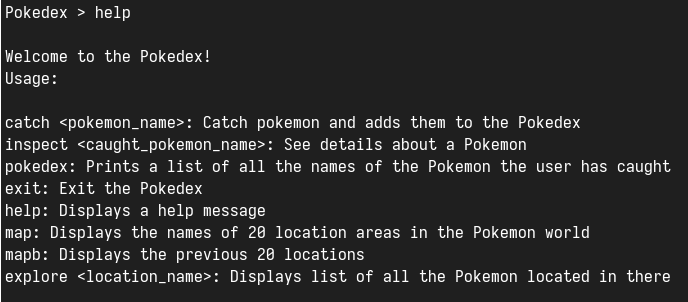
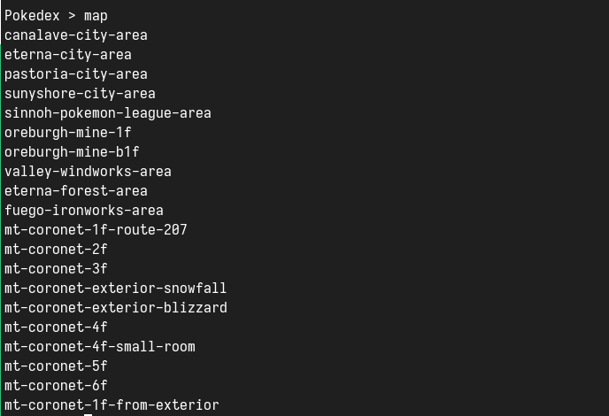
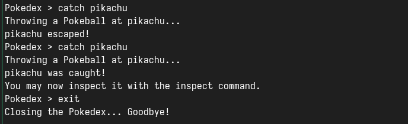

# Pokedex
Pokedex is just a make-believe device that lets you look up information about Pokemon - things like their name, type, and stats.

## Installation and run
Clone this repo and change directory to root of project:

`git clone https://github.com/phucfix/Pokedex.git`

`cd Pokedex`

Run the Pokedex REPL:

`go run .`

## Support command line
- exit: Exit the REPL.
- help: Display help messages.
- map: Display the next page of 20 locations in the Pokemon world.
- mapb: Display the previous page.
- explore: Display list of all Pokemon in a location.
- catch: Try to catch a Pokemon and add them to Pokedex if success.
- inspect: See information of a Pokemon.
- pokedex: View a list of all the names of Pokemon the user has caught.
## Demo

